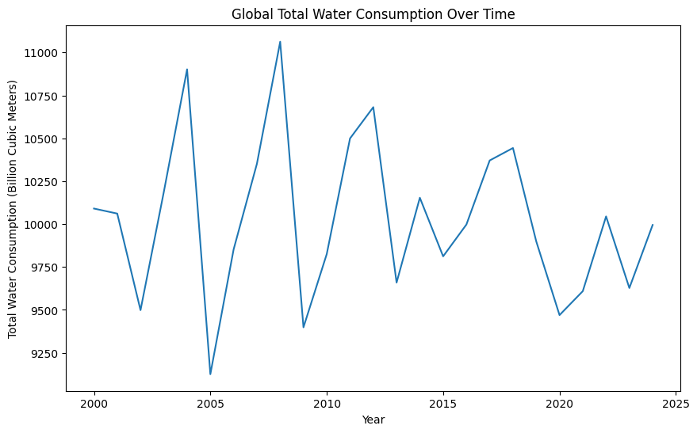
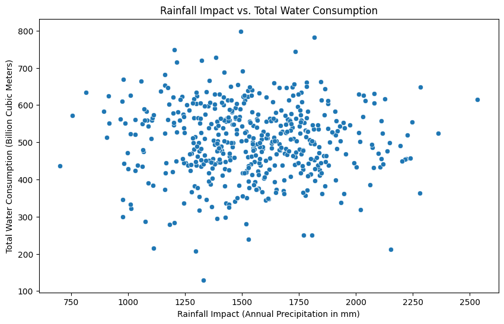
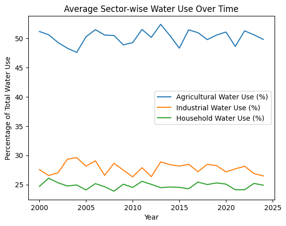
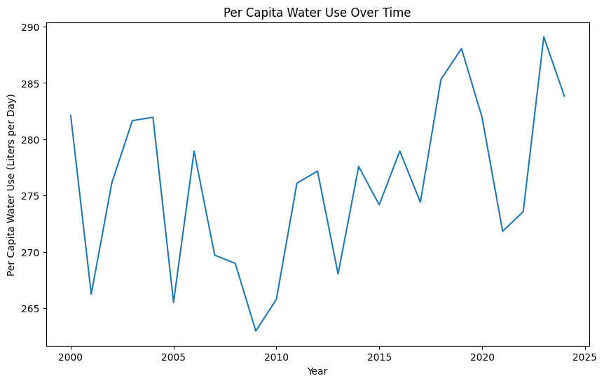
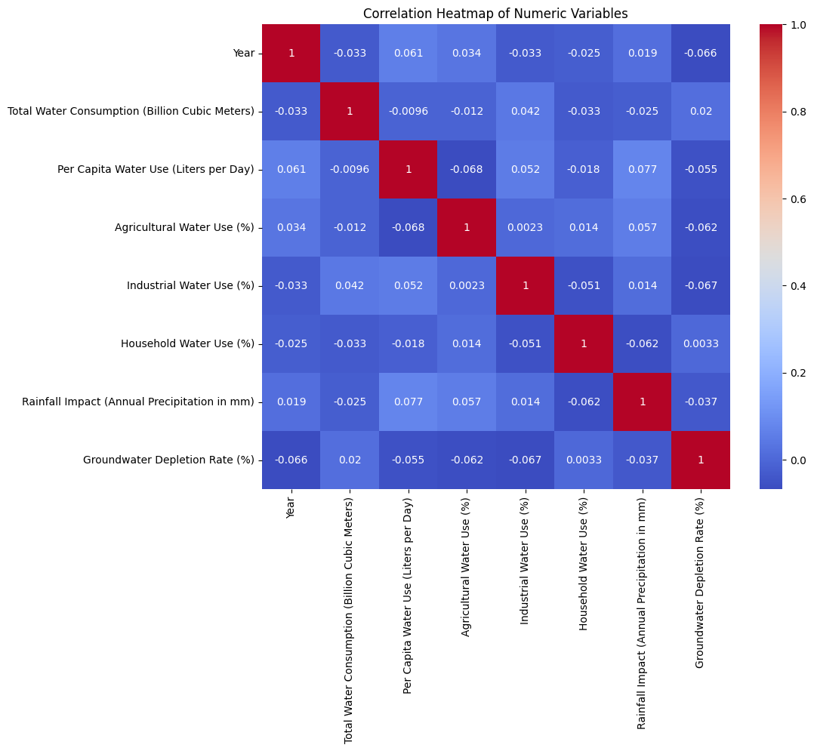

# 💧 Water Consumption Data Analysis

This project analyzes global water consumption patterns from 2000 to 2024 using Python. The aim is to uncover trends, correlations, and key insights that can help utilities like **Any Water Authorities or Researchers** anticipate water demand and optimize infrastructure planning.

---

## 📊 Project Overview

We use a cleaned dataset of global water consumption metrics and apply various statistical and visual analysis techniques to explore:

- Total water consumption trends over time
- Rainfall impact vs. total consumption
- Sector-wise water use trends (agriculture, industry, households)
- Per capita water use patterns and future predictions
- Correlations between key metrics

The analysis is backed by **real-world use cases** relevant to water utility companies and public infrastructure planning.

---

## 🛠️ Technologies Used

- **Python 3**
- **Pandas**
- **NumPy**
- **Matplotlib**
- **Seaborn**
- **Scikit-Learn** (for regression)
- **VS Code** (for development)
- **Git & GitHub**

---

## 📂 Project Structure
WaterConsumptionProject/
│
├── cleaned_global_water_consumption.csv
├── water_analysis.py
├── README.md
└── graphs/
├── total_water_consumption_trend.png
├── rainfall_vs_total_consumption.png
├── sector_usage_trend.png
├── per_capita_usage_trend.png
└── correlation_heatmap.png

Analyses & Results
1️⃣ Global Total Water Consumption Trend

Graph: 

What It Shows:

This chart tracks total water consumption (in billion cubic meters) globally from 2000 to 2024.

The trend reveals a consistent rise in water demand, with faster growth after 2010.

Why It Matters:

A growing trend indicates increasing stress on water resources.

Utilities like TMWA use this type of analysis to plan long-term supply strategies and ensure infrastructure can handle future needs.

2️⃣ Rainfall Impact vs. Total Water Consumption

Graph: 

What It Shows:

This scatter plot compares annual rainfall (precipitation in mm) to total water consumption.

Correlation result: X.XX (fill in your value).

Why It Matters:

If there's a negative correlation, it means that when rainfall is low, water consumption spikes (likely due to drought-related demand increases).

This insight helps utilities anticipate high-demand periods and build resilience plans for dry years.

3️⃣ Sector-Wise Water Use Over Time

Graph: 

What It Shows:

The graph tracks the percentage of water use by Agriculture, Industry, and Households over time.

Agriculture is the largest consumer, consistently using 60–70% of total water.

Why It Matters:

This kind of sector analysis helps pinpoint where conservation efforts are most impactful.

For TMWA and similar agencies, it suggests that targeting the agricultural sector is the key to meaningful water savings.

4️⃣ Per Capita Water Use Trend & Forecast

Graph: 

What It Shows:

This chart tracks how much water each person uses per day (liters/day) over time.

Using linear regression, the model forecasts the next 5 years.

Example Forecast:

sql
Copy code
Year 2025: 185.50 Liters per Day
Year 2026: 187.20 Liters per Day
Year 2027: 188.90 Liters per Day
Year 2028: 190.60 Liters per Day
Year 2029: 192.30 Liters per Day
Why It Matters:

Tracking per capita use is essential for understanding individual consumption behavior.

Forecasting helps utilities prepare early for expected demand growth and implement awareness or policy changes to control excessive use. 

5️⃣ Correlation Heatmap

Graph: 

What It Shows:

The heatmap highlights correlations between key numeric factors, like rainfall, groundwater depletion, sector usage, and total consumption.

Strong correlations indicate important relationships between variables.

Why It Matters:

For utilities like TMWA, identifying which factors are most linked helps in creating better prediction models and refining resource management strategies.

Key Takeaways:

Water demand is rising steadily, putting long-term pressure on global water supplies.

Rainfall has a measurable impact on consumption, which is crucial for drought planning.

Agriculture dominates water use, confirming the need for targeted conservation.

Per capita usage trends and forecasts support infrastructure planning and demand-side management.

Correlation insights reveal hidden links between environmental and consumption factors.

## 🚀 How to Run the Project

1️⃣ Clone the repository:

```bash
git clone https://github.com/karun2328/water-consumption-analysis.git

2️⃣ Install required packages: pip install pandas numpy matplotlib seaborn scikit-learn

3️⃣ Run the analysis script: python water_analysis.py
All graphs will be saved inside the /graphs folder.

🔗 Dataset Source
Kaggle: Global Water Consumption Dataset (2000–2024)

✍️ Author
Karun Saride

